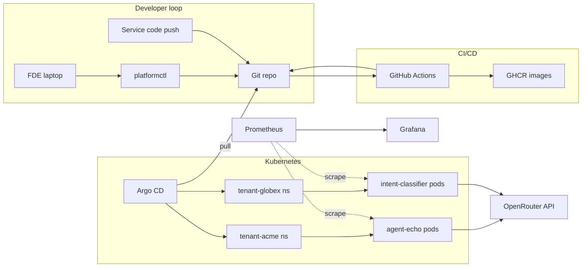

# Architecture

## Goal in one sentence

Give Forward Deployed Engineers a platform where "customer N wants a custom
AI integration" becomes a few commits: one for the service code, one for
the tenant wiring, and a merged PR puts an isolated, observable, non-root
service into Kubernetes with ingress, metrics, and policy already attached.

## The core mental model

The platform is a set of SHARED MACHINERY:

- One Helm chart (`charts/agent-integration`) that describes the shape of
  any integration service.
- One reusable CI workflow (`.github/workflows/reusable-service.yml`) that
  builds, tests, scans, pushes, and opens a GitOps bump PR for any service.
- One Argo CD `AppProject` (`tenants`) that scopes where tenants can deploy.
- One set of cluster add-ons (ingress-nginx, Prometheus, Argo CD, Sealed
  Secrets) installed by `modules/platform-bootstrap`.

The platform does NOT ship any particular integration. Those live under
`services/` and are DIFFERENT code, DIFFERENT images, DIFFERENT endpoint
contracts, DIFFERENT Python env-var prefixes. This repo ships two examples:

| Service             | What it does                     | Image                              |
| ------------------- | -------------------------------- | ---------------------------------- |
| `agent-echo`        | Wraps an LLM chat completion     | `ghcr.io/<org>/agent-echo`         |
| `intent-classifier` | Utterance -> fixed intent label  | `ghcr.io/<org>/intent-classifier`  |

Tenants are mapped to services 1:N via their Argo CD Application:

| Tenant   | Service             | Why                                     |
| -------- | ------------------- | --------------------------------------- |
| `acme`   | `agent-echo`        | Needs a generic chat endpoint           |
| `globex` | `intent-classifier` | Wants utterance -> business intent      |

Adding a new customer typically means: create a new service (copy an
existing one, rewrite the business logic), push the image through CI,
onboard a tenant pointed at that new image.

## Components



Note the different colored boxes in tenant-acme vs tenant-globex: same
chart, different image, different code.

## Control-plane vs data-plane

- Control plane = Git. Every durable change (new service, new tenant,
  chart bump, image tag bump, infra change) is a commit. Humans never
  touch `kubectl apply` or the cloud console.
- Data plane = the running cluster. Argo CD reconciles the cluster to
  match `main`. Reverts = `git revert`.

## Multi-tenancy model

| Layer | Mechanism |
| --- | --- |
| Isolation of secrets / data | `tenant-<name>` namespace, `ResourceQuota`, non-root container |
| Isolation of network | Default-deny `NetworkPolicy` + narrow allow rules |
| Isolation of blast radius | One Argo CD `Application` per tenant (fail independently) |
| Quota enforcement | `ResourceQuota` + HPA bounded max |
| Tenant identity propagation | `tenant=<name>` label + env var + log context |
| Service pinning | `devops.platform/service=<service>` label on the Application |

## Service ownership model

Every service is self-contained:

```
services/<service>/
    app/                # Python source
    tests/              # pytest
    Dockerfile          # multi-stage, non-root, UID 10001
    pyproject.toml      # pinned deps
    README.md           # what the service does
```

Every service has a matching thin caller workflow at
`.github/workflows/<service>.yml` that invokes the reusable pipeline and
lists which tenants currently run this service. That list is the one place
that couples a service to its tenants; everything else is service-agnostic.

## IaC layering

```text
modules/kind-cluster      -> laptop kind cluster
modules/aks-cluster       -> Azure AKS + ACR + Log Analytics
modules/platform-bootstrap -> argocd + ingress-nginx + prom stack + sealed-secrets
                              (cluster-agnostic: works on kind or AKS)

envs/local       -> kind-cluster + platform-bootstrap
envs/azure-dev   -> aks-cluster + platform-bootstrap
```

The `platform-bootstrap` module is the key abstraction: it doesn't know
whether it's running on kind or AKS. Providers are wired up by the caller.

## CI strategy

- `reusable-service.yml` is a library workflow. Any new integration service
  adds a ~15-line caller like `agent-echo.yml` / `intent-classifier.yml`.
- On `push main` for `services/<service>/**`, that service's pipeline
  builds + scans + pushes to GHCR, then opens a PR that bumps the image
  tag in every tenant values file listed in that caller workflow.
- Each caller workflow lists ONLY the tenants that run that service. A
  push to `services/agent-echo/` never moves globex's pinned image; a push
  to `services/intent-classifier/` never moves acme's.
- Merging the bump PR is the release. Argo CD handles the rollout.

## Observability minimums

- Metrics: `/metrics` per service, ServiceMonitor auto-picked up by the
  Prometheus Operator. Each service uses its own metric-name prefix
  (`agent_echo_*`, `intent_classifier_*`) so dashboards can slice per service.
- Logs: JSON lines via `structlog`, bound with `service`, `tenant`,
  `environment`, `request_id`. On AKS, Container Insights picks them up
  automatically.
- Traces: out of scope for the weekend; the apps are structured so adding
  OTel is a small diff (import `opentelemetry.instrumentation.fastapi`).

## Secrets

- Local: `kubectl create secret` helper script (dev only).
- GitOps-friendly: Sealed Secrets is installed, ready to use.
- Azure production path: Workload Identity (enabled on AKS) + External
  Secrets Operator pulling from Key Vault.

## Explicit non-goals

- Service mesh: `NetworkPolicy` is sufficient here.
- Multi-region / DR: single-cluster demo.
- Full SSO for Argo CD / Grafana: would wire OIDC in a real deployment.
- Cost controls beyond quotas: a real platform would add Kubecost.
- Shared library for services (structlog config, metrics helpers): in
  reality you'd factor `services/agent-echo/app/logging_config.py` +
  `metrics.py` into a `libs/obs-py/` package. The demo keeps each service
  self-contained so you can read one top-to-bottom without jumping around.

## Failure modes this handles

- Bad commit in GitOps repo: Argo CD reports OutOfSync/Degraded; `git revert`
  rolls back. No cluster access needed.
- Bad container image: readiness probe keeps bad pods out of rotation; rolling
  update (`maxUnavailable: 0`) prevents downtime.
- Noisy tenant: `ResourceQuota` caps blast radius.
- One tenant calling another: default-deny NetworkPolicy blocks it.
- OpenRouter outage: `/ready` goes 503, metrics show
  `<service>_openrouter_latency_seconds{outcome!="ok"}`.
- One service going bad: only its tenants are affected; other services on
  the same cluster are fine (separate images, separate CI pipelines,
  separate namespaces).
